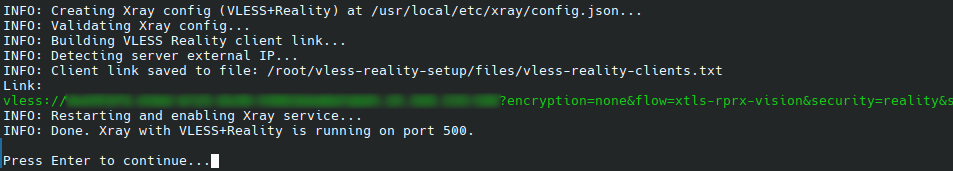

# VLESS + Reality VPN Server Setup for Ubuntu VPS (Xray)

This repository provides a simple script to deploy a VLESS server with REALITY transport on an Ubuntu VPS using Xray core.

Installation and client management are performed entirely from the terminal in a single interactive script. No Docker containers, no web interfaces, no additional services are required.

## Requirements

- **OS:** Ubuntu (tested on 24.04). May work on other Debian-based systems.
- **Root:** The manager must be run as root (or with `sudo`).
- **Port:** Configurable at install (default 443); the chosen port must be free (no other service should listen on it).

## Running the manager

Clone the repository (e.g. from your home directory), then run the manager from the repo directory:

```bash
git clone https://github.com/ivan-khludov/vless-reality-setup.git
sudo ./vless-reality-setup/bin/vless-manager.sh
```

You’ll see the main menu. **Before the first install** only **1) Install** and **0) Exit** are shown. **After install**, the full menu appears.

Before install:

```
===============================
  VLESS Reality Server Manager
===============================

1) Install
0) Exit

Select option:
```

After install:

```
===============================
  VLESS Reality Server Manager
===============================

1) Uninstall
2) Add client
3) Remove client
4) Show clients
5) Change port
6) Change SNI
7) Start server
8) Stop server
9) Server status
10) Xray logs
11) Restore clients from backup
12) Turn on Firewall / Turn off Firewall
0) Exit

Select option:
```

Options 2–12 are only visible after the server is installed. Descriptions:

- **1) Install / Uninstall** — Label shows **Install** when the server is not installed, **Uninstall** when config exists. **Install:** first-time setup: installs dependencies and Xray, generates keys, creates VLESS Reality config, starts the service, sets up a health endpoint on port 8080 (socat + script), and prints the first client link and the health URL. You’ll be prompted for SNI (default `www.cloudflare.com`), listen port (default 443), and client name. **Uninstall:** you must type **DELETE** to confirm. Then it stops and disables Xray and the health endpoint, disables the firewall (ufw) if it was on, and removes the systemd units, Xray binary, config directory, health script, and socat. You are asked whether to remove client data in `files/` (keys, backups, client links); default is yes. You are then asked whether to remove ufw (firewall) if it was installed by the script; default is no. curl, openssl, jq, and uuid-runtime are not removed (common system tools).
- **2) Add client** — Adds a new client (new UUID and short id), restarts Xray, and appends the new link to the clients file. Requires an existing install.
- **3) Remove client** — Shows the client list, then asks for the client number to remove. You must type **YES** to confirm. Restarts Xray and rewrites the clients file.
- **4) Show clients** — Lists all clients with their numbers, UUIDs, shortIds, and VLESS links.
- **5) Change port** — Prompts for the new listen port, updates config, restarts Xray, and rewrites client links. If the firewall (ufw) is on, the old port is closed and the new port is opened automatically.
- **6) Change SNI** — Prompts for the new SNI (and updates Reality dest), restarts Xray, and rewrites client links.
- **7) Start server** — Starts the Xray systemd service.
- **8) Stop server** — Stops the Xray systemd service.
- **9) Server status** — Shows `systemctl status xray`.
- **10) Xray logs** — Shows live logs (`journalctl -u xray -f`); press Ctrl+C to exit.
- **11) Restore clients from backup** — Lists backups in `files/backups/` (newest first); choose by number, type **RESTORE** to confirm. Restores config, restarts Xray, and rewrites the client links file.
- **12) Turn on Firewall / Turn off Firewall** — Label depends on whether ufw is active. Turn on: allows SSH (22/tcp), the current VLESS port, and the health port (8080/tcp), then enables ufw. Turn off: disables ufw. Firewall is not enabled at install time.
- **0) Exit** — Quit the manager.

Dangerous actions (**Remove client** and **Uninstall server**) require explicit confirmation as noted above.

### Example install output

After the first install, the script prints the initial VLESS link:



Use the links from `files/vless-reality-clients.txt` in a VLESS Reality–compatible client (e.g. v2rayN, Nekoray, Shadowrocket, Hiddify).

## Backup

Before every config change (add/remove client, change port or SNI), a backup of the current Xray config is created in `files/backups/` with a timestamped name:

- **Path:** `files/backups/config.json.bak.<unix_timestamp>`

The script automatically keeps only the **20 most recent** backups and deletes older ones.  
You can restore from the menu (option 11) or manually by copying a backup over `config.json` and restarting Xray.

## Important paths

| Path                                        | Description                                                                                                              |
| ------------------------------------------- | ------------------------------------------------------------------------------------------------------------------------ |
| `/usr/local/etc/xray/config.json`           | Xray config                                                                                                              |
| `http://<server>:8080/health`               | Health endpoint (installed at Install). Responses and `problems[]` codes are documented under **Health endpoint** below. |
| `files/backups/config.json.bak.<timestamp>` | Timestamped config backups (created before each config change)                                                           |
| `files/vless-reality-clients.txt`           | Client VLESS links (`files/` is gitignored)                                                                              |
| `files/.vless-reality-public-key`           | Server Reality public key; used when adding clients                                                                      |
| `files/server-ip`                           | Cached server IP for links; set at first run. Edit and re-run “Change port” or “Change SNI” to refresh links.            |

## Security and reliability

- **Xray** runs as the unprivileged user `nobody` with minimal capabilities (`CAP_NET_BIND_SERVICE` only). A hardened systemd unit is applied at install time: strict sandboxing (`ProtectSystem`, `ProtectHome`, `PrivateTmp`, etc.), no write access outside the service runtime, and config directory read-only.
- **Restart policy:** `Restart=on-failure` with a short delay and a start limit so the service recovers from crashes without looping indefinitely.
- Logs go to the system journal (`journalctl -u xray -f`); see menu option 10.
- **Health endpoint:** A lightweight HTTP listener on port **8080** (socat + `scripts/health-responder.sh`) for monitoring. Only **GET** `http://<server>:8080/health` runs the checks below; other paths return **404**. Malformed requests may yield **400**. Service logs: `journalctl -u vless-health`.

  **Checks (in order):** Xray binary exists and is executable; config file exists and is non-empty; first inbound uses Reality (`streamSettings.security == "reality"`); `systemctl` reports Xray active; a process named `xray` is running; something is listening on the VLESS port from config (localhost TCP probe); `xray -test -config` succeeds within 15 seconds.

  **HTTP responses**

  | Status  | Meaning                                                                                         |
  | ------- | ----------------------------------------------------------------------------------------------- |
  | **200** | All checks passed. JSON: `status` (`OK`), `checked_at` (ISO-8601).                              |
  | **503** | At least one check failed. JSON: `status` (`error`), `problems` (array of codes), `checked_at`. |
  | **404** | URL path is not `/health`. JSON includes `problems`: `["not_found"]`.                           |
  | **400** | Bad or empty request line. JSON includes `problems`: `["bad_request"]`.                         |

  **`problems` codes on 503**

  | Code                  | Meaning                                                                                |
  | --------------------- | -------------------------------------------------------------------------------------- |
  | `xray_binary_missing` | `/usr/local/bin/xray` is missing or not executable.                                    |
  | `config_missing`      | `/usr/local/etc/xray/config.json` is missing or empty.                                 |
  | `invalid_config`      | Config does not mark the first inbound as Reality (script uses `jq` on `inbounds[0]`). |
  | `xray_not_running`    | `systemctl is-active xray` is not active.                                              |
  | `xray_process_dead`   | No running process with name `xray` (`pgrep -x xray`).                                 |
  | `port_not_listening`  | Nothing accepted a TCP connection to `127.0.0.1:<vless_port>` within 1 second.         |
  | `config_test_timeout` | `xray -test` exited due to timeout (15s).                                              |
  | `config_test_failed`  | `xray -test` returned a non-zero exit code (other than timeout).                       |

  Several codes can appear at once if multiple checks fail.

## Support

If this project helps you, optional tips in **USDT (Tron / TRC-20)** are welcome:


Address (TRC-20 / Tron):

```
TNrPGfU3HqtfMPmmhdvrJsQng7Ck9fian4
```

Send **only** USDT over the **Tron network** to this address; using other chains can mean lost funds.

## License

Licensed under the [MIT License](LICENSE).

Version history: [GitHub Releases](https://github.com/ivan-khludov/vless-reality-setup/releases).
